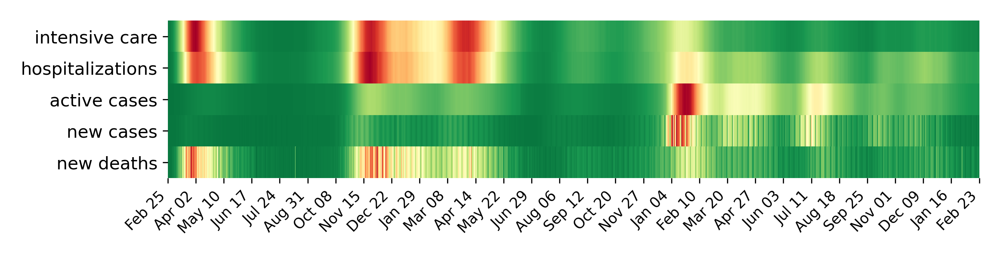
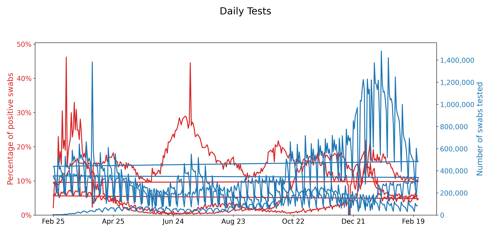

_Updated [automatically](https://github.com/cascandaliato/covid19-notebook/blob/master/.github/workflows/update-notebook.yml) every day at 18:00 (UTC) using my [Papermill Docker Action](https://github.com/cascandaliato/papermill-docker-action)._

Launch an [editable version](https://colab.research.google.com/github/cascandaliato/covid19-notebook/blob/master/charts.ipynb) of the notebook on Google Colab or a [view-only version](charts.ipynb) on GitHub.

