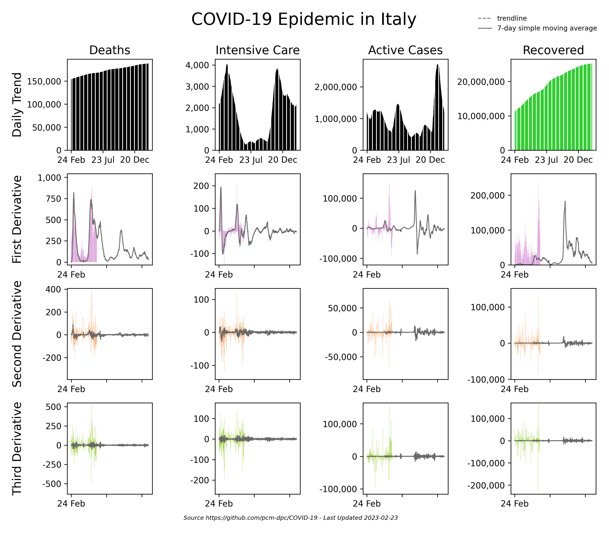

_Updated automatically every day at 20:00 (UTC)._

Launch an [editable version](https://colab.research.google.com/github/casca/covid19-notebook/blob/master/charts.ipynb) of the notebook on Google Colab or a [view-only version](charts.ipynb) on GitHub.

